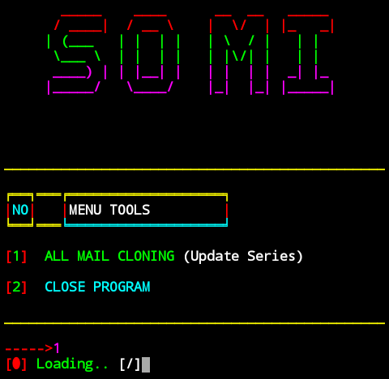
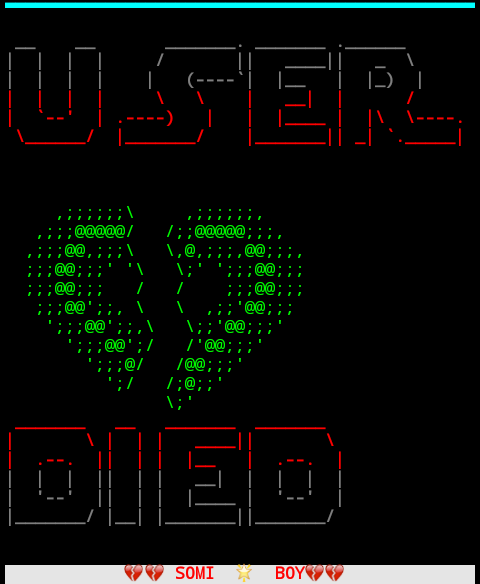

# big-brand 

  

<!--    -->

<!--    -->

# Installation :

 `apt update`

 `apt upgrade -y`

 `apt install git -y`

 `pkg install python`

 `pkg install python2 -y`

 `pip2 install requests`

 `pip2 install mechanize`

 `git clone https://github.com/Somi-Star-boy-44/big-brand.git`

 `cd big-brand`

 `python2 big-brand.py`

[]

## :pencil: License

This project is licensed under [MIT](https://opensource.org/licenses/MIT) license.
